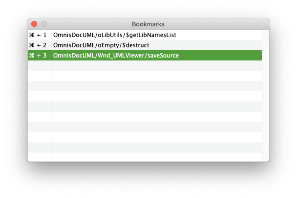

# CodeBookmarks

An utility to quickly navigate between Omnis Classes.

## Features

* Add a bookmark to the current edited method with `Ctrl/Cmd+M`
* Open the Bookmarks window with `Ctrl/Cmd+K`
* Quickly access the Bookmarks with `Ctrl/Cmd+1-9`
